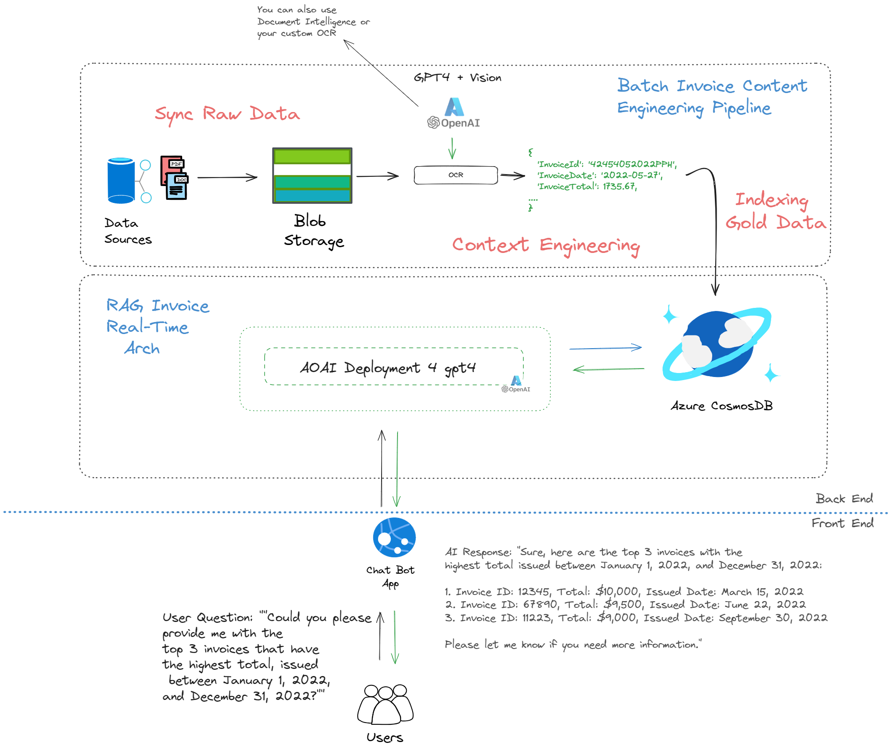

#  Chat with your invoices 💬

This repository contains code and logic for developing a robust, scalable, and efficient architecture that allows you to process your invoices. Furthermore, it enables you to interact with the extracted data using a conversational AI model similar to ChatGPT. This allows you to create your company's "InvoicesChatGPT" with all the flexibility and add-ons needed, leveraging the strength of SOTA Azure AI services.

## 🚀 Solution Overview

## 🔧 Prerequisites

Please make sure you have met all the prerequisites for this project. A detailed guide on how to set up your environment and get ready to run all the notebooks and code in this repository can be found in the [SETTINGS.md](SETTINGS.md) file. Please follow the instructions there to ensure a smooth exprience.

## 🔄 Continuous Integration/Continuous Deployment (CI/CD) (preview)

This project leverages GitHub Actions for automating our DevOps lifecycle. More #TODO

You can view the configuration and status of our GitHub Actions workflows in the `.github/workflows` directory and the "Actions" tab of our GitHub repository, respectively.

## 💼 Contributing:

Eager to make significant contributions? Our **[CONTRIBUTING](./CONTRIBUTING.md)** guide is your essential resource! It lays out a clear path.
